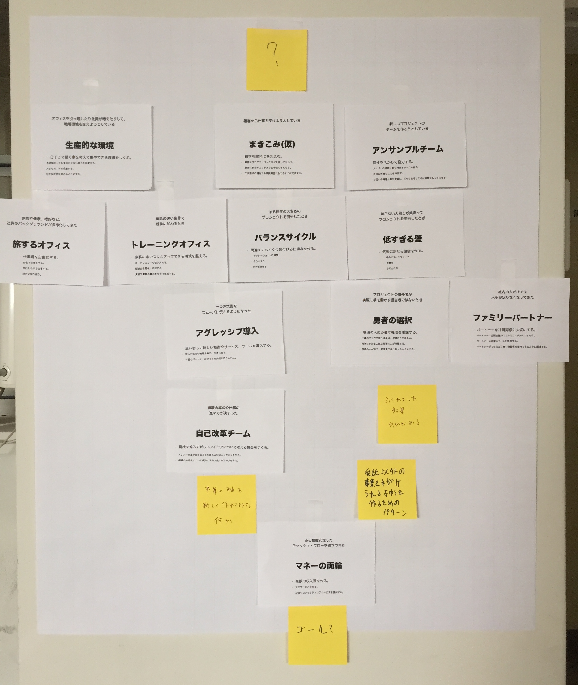

KRAYパターン
=============

KRAYパターンは、[KRAY](http://kray.jp)の理想的な状態を考え、実現するための[パターン・ランゲージ](https://ja.wikipedia.org/w/index.php?title=%E3%83%91%E3%82%BF%E3%83%B3%E3%83%BB%E3%83%A9%E3%83%B3%E3%82%B2%E3%83%BC%E3%82%B8)です。日々の業務をパターンと見比べることで、自分たちの仕事を見直せます。KRAYを知らない人は、KRAYパターンを見ることで、ポリシーや仕事のしかたを知ることができます。KRAYパターンは、KRAYの文化を形にし、知ってもらうためのツールでもあるのです。

自分たちがパターンよりも良いやり方をしていることに気づいた場合、パターンは更新される機会を得ます。パターン・ランゲージは、対象の実体と一緒に成長します。つまり、KRAYとKRAYパターンは今も成長中です。

（組織の文化をパターンにしてみたい方がいらっしゃいましたら、[KRAYサイト](http://kray.jp)からお問い合わせください。ご希望に従って、最適な形でサポート致します。）

パターンの順序
------

パターン同士の間には依存関係があります。つまり、あるパターンを実行するには、先に別のパターンを済ませておいた方が良いという関係です。KRAYパターンは写真の上から下の順に使うとよいようです。

パターンもくじ
------

1. [シャングリラオフィス](patterns/shangri_la_office.md)
1. [あいのり駆動](patterns/ainori_driven.md)
3. [アンサンブルチーム](patterns/ensemble_team.md)
6. [トレーニングオフィス](patterns/training_office.md)
2. [バランスサイクル](patterns/balance_cycle.md)
1. [低すぎる壁](patterns/low_barriers.md)
5. [アグレッシブ導入](patterns/aggressive_adoption.md)
9. [勇者の選択](patterns/heroic_decision.md)
4. [ファミリーパートナー](patterns/family_partner.md)
1. [ふりかえりスパイラル](patterns/self_renovation.md)
9. [マネーの両輪](patterns/two_wheels_of_money.md)
7. [旅するオフィス](patterns/traveling_office.md)
